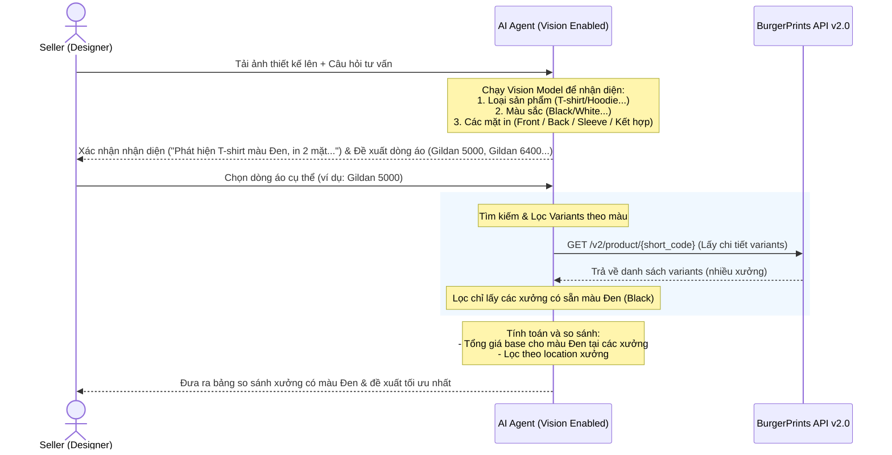

# UC-Bonus: Phân tích ảnh thiết kế (Multimodal Design Analysis) & Đề xuất Fulfillment

> **Trạng thái:** Yêu cầu mở rộng (Optional Bonus)
> **Mục tiêu:** Cho phép Seller (đặc biệt là các Designer) tải lên ảnh thiết kế (Artwork/Mockup), AI Agent tự động nhận diện loại sản phẩm, vị trí in, và đưa ra gợi ý nhà in (Fulfillment partner) tối ưu về giá và tốc độ giao hàng.

---

## 1. Mô tả trường hợp sử dụng (Use Case Description)

| Thành phần | Chi tiết |
|------------|----------|
| **Tên Use Case** | Nhận diện ảnh thiết kế và đề xuất Fulfillment tối ưu |
| **Mã định danh** | UC-BONUS-01 |
| **Tác nhân** | Seller (Designer) |
| **Mô tả** | Seller gửi một hình ảnh thiết kế lên cửa sổ chat. Agent sử dụng khả năng đa phương thức (Multimodal - như Gemini 1.5/2.0) để nhận diện loại áo (T-shirt/Hoodie/Sweatshirt) và các mặt cần in (mặt trước, mặt sau, tay áo trái/phải, hoặc kết hợp), sau đó gọi BurgerPrints API để tìm kiếm và so sánh các xưởng in phù hợp nhất. |
| **Tiền điều kiện** | Agent được cấu hình model hỗ trợ Vision (ví dụ: `gemini-1.5-flash` hoặc `gpt-4o`). |
| **Hậu điều kiện** | Seller nhận được đề xuất nhà in kèm bảng so sánh giá base cost, phí in thêm mặt (nếu in 2 mặt) và xưởng tối ưu nhất cho thiết kế đó. |

---

## 2. Luồng xử lý chính (Basic Flow)

### Chi tiết các bước:
1. **Tác nhân gửi yêu cầu:** Seller tải lên một file ảnh thiết kế (ví dụ: mẫu mockup áo T-shirt màu đen có in mặt trước và mặt sau) kèm tin nhắn: *"Tư vấn xưởng in mẫu này giúp mình."*
2. **Phân tích hình ảnh:** Agent kích hoạt phân tích đa phương thức (Vision) từ ảnh đầu vào:
   * **Phát hiện loại sản phẩm (Category Detection):** Nhận diện mẫu là "T-shirt" (Áo thun).
   * **Phát hiện màu sắc (Color Detection):** Nhận diện màu áo là "Black" (Đen).
   * **Phát hiện vị trí in (Print Location Detection):** Phát hiện hình in ở mặt trước (Front) và mặt sau (Back) -> Xác định là **Multi-sided Print**.
3. **Đề xuất dòng áo cơ bản và chờ xác nhận:**
   * Thay vì đề xuất xưởng ngay, Agent gợi ý các dòng T-shirt phổ biến có trong catalog BurgerPrints để Seller chọn trước (ví dụ: **Gildan 5000 (USG5000)** - giá rẻ, vải dày; **Gildan 64000 (USG64000)** - mềm mịn, form ôm; hoặc **Bella + Canvas 3001 (USBC3001)** - cao cấp).
   * Seller phản hồi lựa chọn: *"Mình chọn Gildan 5000 nhé."*
4. **Gọi API và lọc theo màu sắc xưởng:**
   * Agent gọi API `GET /v2/product/{short_code}` (với `{short_code}` = `USG5000`).
   * Trích xuất danh sách biến thể (`variations[]`).
   * **Kiểm tra tính khả dụng của màu sắc:** Lọc các variation có `color` khớp với màu đã phát hiện ("Black"). Do mỗi xưởng fulfillment (partner) có bảng màu khác nhau (ví dụ: Xưởng A có sẵn áo Gildan 5000 màu Đen, nhưng Xưởng B chỉ có màu Trắng và Navy), Agent sẽ chỉ giữ lại các xưởng có sẵn màu Đen.
5. **Tính toán chi phí in ấn:**
   * Agent tính toán tổng giá base cho màu Đen tại các xưởng còn lại: `Total Base Cost = price (giá base gốc cho màu Đen) + addition_price (phụ phí in mặt thứ 2)`.
6. **Phản hồi người dùng:** Agent hiển thị bảng so sánh chi phí màu Đen giữa các xưởng đáp ứng được và đề xuất xưởng tối ưu nhất theo thị trường mục tiêu.

---

## 3. Các luồng phụ & Xử lý ngoại lệ (Alternative & Exception Flows)

### Luồng phụ A: Ảnh chỉ thiết kế thô (Artwork/PNG không có mockup áo)
* **A1.** Seller chỉ gửi tệp PNG thiết kế gốc (không lồng vào mockup áo).
* **A2.** Agent nhận diện được họa tiết nhưng không biết là áo gì.
* **A3.** Agent phản hồi: *"Mình đã nhận được file thiết kế của bạn. Bạn muốn in mẫu này lên loại áo nào (T-shirt, Hoodie, hay Sweatshirt)?"* và chờ Seller chọn.

### Luồng ngoại lệ B: Ảnh mờ hoặc không thể nhận dạng được mặt in
* **B1.** Ảnh tải lên quá mờ hoặc góc chụp không rõ ràng để xác định có in mặt sau hay không.
* **B2.** Agent báo lại: *"Mình nhận diện được đây là áo Hoodie, nhưng chưa rõ thiết kế này cần in 1 mặt hay 2 mặt. Bạn vui lòng xác nhận giúp mình nhé!"*
* **B3.** Seller xác nhận: *"Chỉ in mặt trước"* hoặc *"In cả 2 mặt"*.
* **B4.** Agent tiếp tục từ Bước 3 của luồng xử lý chính.

---

## 4. Kịch bản hội thoại mẫu (Sample Dialogues)

### Kịch bản 1: Nhận diện, chọn dòng sản phẩm và lọc theo màu áo
> **Seller:** *(Tải lên ảnh mockup T-shirt đỏ có in trước, sau và tay áo trái)* "Tư vấn giúp mình xưởng in mẫu này gửi đi Mỹ."
>
> **Agent:**
> 🔍 **Kết quả phân tích thiết kế:**
> * **Loại sản phẩm:** Áo T-shirt (Unisex T-shirt)
> * **Màu sắc:** Đỏ (Red)
> * **Vị trí in:** In nhiều vị trí (Mặt trước + Mặt sau + Tay áo trái)
>
> Trên BurgerPrints có nhiều dòng T-shirt phổ biến. Bạn muốn tham khảo dòng áo nào trước để mình lọc xưởng?
> 1. **Gildan 5000 (USG5000):** Giá tối ưu, chất vải cotton thô dày dặn (Phổ biến nhất).
> 2. **Gildan 64000 (USG64000):** Vải mềm mịn hơn, form ôm nhẹ trẻ trung.
> 3. **Bella + Canvas 3001 (USBC3001):** Dòng cao cấp, siêu mềm, phù hợp làm brand cao cấp.
>
> **Seller:** "Gildan 5000 nha."
>
> **Agent:**
> ⏳ *Đang kiểm tra tính khả dụng của màu **Đỏ (Red)** cho dòng Gildan 5000 tại các xưởng ở Mỹ...*
>
> Dưới đây là các xưởng ở Mỹ đang hỗ trợ sẵn màu **Đỏ (Red)** cho dòng Gildan 5000 (in 2 mặt + tay áo):
>
> | Xưởng | Giá áo Red (Base) | Phụ phí mặt 2 | Phụ phí in tay áo | Tổng Base Cost | Trạng thái màu Red | Đánh giá |
> | :--- | :---: | :---: | :---: | :---: | :---: | :--- |
> | **Blanca** | $6.20 | $4.00 | $3.00 | **$13.20** | ✅ Có sẵn | Tối ưu chi phí và xử lý nhanh |
> | **PrintWay** | $6.50 | $4.20 | $3.20 | **$13.90** | ✅ Có sẵn | Giá cao hơn một chút |
> | *SwiftPrint* | - | - | - | - | ❌ Không có màu Red | Chỉ có Black, White, Navy |
>
> 💡 **Khuyến nghị:** Bạn nên chọn xưởng **Blanca** cho thiết kế màu Đỏ này. Xưởng SwiftPrint bị loại vì không cung cấp màu đỏ cho Gildan 5000. Bạn có muốn tạo đơn hàng Sandbox thử không?

---

## 5. Tiêu chuẩn đánh giá kỹ thuật (Technical Verification)

Để tính năng này hoạt động chính xác, module kiểm thử tự động của Agent cần xác minh các điều kiện:
1. **Độ chính xác nhận diện (Vision Accuracy):**
   * Phân loại đúng loại áo (T-shirt vs Hoodie vs Sweatshirt) đạt độ chính xác > 90% trên tập test 10 mẫu.
   * Phát hiện chính xác vị trí in (mặt trước / mặt sau / cả hai) đạt > 95%.
2. **Khớp nối dữ liệu API:**
   * Khi in 2 mặt được kích hoạt, Agent bắt buộc phải cộng thêm trường `addition_price` vào tổng chi phí tư vấn. Nếu `addition_price` trong API trả về là `null` hoặc bằng 0, Agent phải mặc định áp dụng cấu hình phụ phí chung của xưởng hoặc cảnh báo cho người dùng.
3. **Phản hồi lỗi an toàn (Graceful Degradation):**
   * Nếu kết nối API bị lỗi hoặc không phân tích được ảnh, Agent vẫn phải hỗ trợ Seller nhập liệu bằng text để nhận tư vấn.
