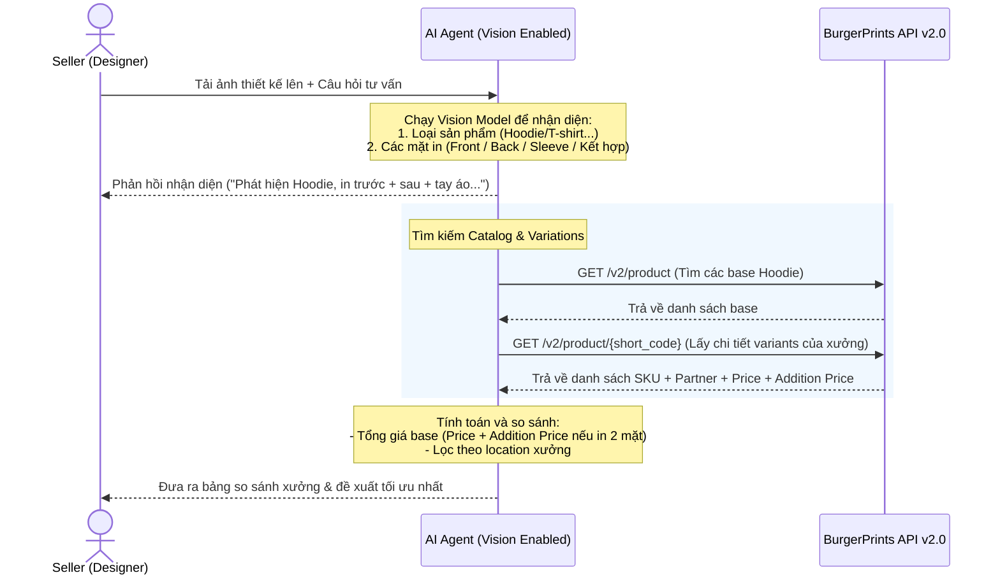

# UC-Bonus: Phân tích ảnh thiết kế (Multimodal Design Analysis) & Đề xuất Fulfillment

> **Trạng thái:** Yêu cầu mở rộng (Optional Bonus)
> **Mục tiêu:** Cho phép Seller (đặc biệt là các Designer) tải lên ảnh thiết kế (Artwork/Mockup), AI Agent tự động nhận diện loại sản phẩm, vị trí in, và đưa ra gợi ý nhà in (Fulfillment partner) tối ưu về giá và tốc độ giao hàng.

---

## 1. Mô tả trường hợp sử dụng (Use Case Description)

| Thành phần | Chi tiết |
|------------|----------|
| **Tên Use Case** | Nhận diện ảnh thiết kế và đề xuất Fulfillment tối ưu |
| **Mã định danh** | UC-BONUS-01 |
| **Tác nhân** | Seller (Designer) |
| **Mô tả** | Seller gửi một hình ảnh thiết kế lên cửa sổ chat. Agent sử dụng khả năng đa phương thức (Multimodal - như Gemini 1.5/2.0) để nhận diện loại áo (T-shirt/Hoodie/Sweatshirt) và các mặt cần in (mặt trước, mặt sau, tay áo trái/phải, hoặc kết hợp), sau đó gọi BurgerPrints API để tìm kiếm và so sánh các xưởng in phù hợp nhất. |
| **Tiền điều kiện** | Agent được cấu hình model hỗ trợ Vision (ví dụ: `gemini-1.5-flash` hoặc `gpt-4o`). |
| **Hậu điều kiện** | Seller nhận được đề xuất nhà in kèm bảng so sánh giá base cost, phí in thêm mặt (nếu in 2 mặt) và xưởng tối ưu nhất cho thiết kế đó. |

---

## 2. Luồng xử lý chính (Basic Flow)

### Chi tiết các bước:
1. **Tác nhân gửi yêu cầu:** Seller tải lên một file ảnh thiết kế (ví dụ: mẫu mockup áo Hoodie màu đen có in cả mặt trước và mặt sau) kèm tin nhắn: *"Tư vấn xưởng in mẫu này giúp mình."*
2. **Phân tích hình ảnh:** Agent kích hoạt phân tích đa phương thức (Vision) từ ảnh đầu vào:
   * **Phát hiện loại sản phẩm (Category Detection):** Nhận diện mẫu là "Hoodie" (Áo nỉ có mũ).
   * **Phát hiện vị trí in (Print Location Detection):** Phát hiện hình in ở mặt trước, mặt sau, tay áo trái (Left Sleeve) và/hoặc tay áo phải (Right Sleeve) -> Xác định thuộc loại **Multi-sided Print (In nhiều mặt/vị trí)**.
3. **Gọi API và khớp dữ liệu:**
   * Agent gọi API `GET /v2/product` để tìm các sản phẩm áo Hoodie (ví dụ: `USG18500` - Unisex Hoodie Gildan 18500).
   * Agent gọi tiếp API `GET /v2/product/{id}` để trích xuất danh sách tất cả các biến thể (`variations`).
4. **Tính toán chi phí in ấn:**
   * Do phát hiện in nhiều mặt/in tay áo, Agent sẽ tính toán tổng giá base: `Total Base Cost = price (giá base gốc) + các phụ phí in thêm mặt/in tay áo (addition_price tương ứng)`.
   * Đối với các xưởng (ví dụ: *Blanca*, *PrintWay*, v.v.), Agent sẽ so sánh giá và thời gian xử lý (`Processing Time` trích xuất từ `html_desc`).
5. **Phản hồi người dùng:** Agent hiển thị kết quả phân tích rõ ràng:
   * Nhận diện: Áo Hoodie, in nhiều vị trí (Mặt trước + Mặt sau + Tay áo).
   * Bảng so sánh chi phí giữa các xưởng có cung cấp dòng áo này.
   * Đề xuất xưởng in tối ưu nhất dựa trên thị trường (ví dụ: chọn xưởng ở US nếu ship US để tối ưu thời gian giao hàng).

---

## 3. Các luồng phụ & Xử lý ngoại lệ (Alternative & Exception Flows)

### Luồng phụ A: Ảnh chỉ thiết kế thô (Artwork/PNG không có mockup áo)
* **A1.** Seller chỉ gửi tệp PNG thiết kế gốc (không lồng vào mockup áo).
* **A2.** Agent nhận diện được họa tiết nhưng không biết là áo gì.
* **A3.** Agent phản hồi: *"Mình đã nhận được file thiết kế của bạn. Bạn muốn in mẫu này lên loại áo nào (T-shirt, Hoodie, hay Sweatshirt)?"* và chờ Seller chọn.

### Luồng ngoại lệ B: Ảnh mờ hoặc không thể nhận dạng được mặt in
* **B1.** Ảnh tải lên quá mờ hoặc góc chụp không rõ ràng để xác định có in mặt sau hay không.
* **B2.** Agent báo lại: *"Mình nhận diện được đây là áo Hoodie, nhưng chưa rõ thiết kế này cần in 1 mặt hay 2 mặt. Bạn vui lòng xác nhận giúp mình nhé!"*
* **B3.** Seller xác nhận: *"Chỉ in mặt trước"* hoặc *"In cả 2 mặt"*.
* **B4.** Agent tiếp tục từ Bước 3 của luồng xử lý chính.

---

## 4. Kịch bản hội thoại mẫu (Sample Dialogues)

### Kịch bản 1: Nhận diện và gợi ý hoàn hảo (In 2 mặt + Tay áo)
> **Seller:** *(Tải lên ảnh mockup Hoodie đen có logo nhỏ ở ngực, hình vẽ lớn ở lưng và họa tiết dọc tay áo trái)* "Tư vấn giúp mình xưởng in mẫu này gửi đi Mỹ."
>
> **Agent:**
> 🔍 **Kết quả phân tích thiết kế:**
> * **Loại sản phẩm:** Áo Hoodie (Unisex Hoodie)
> * **Vị trí in:** In nhiều vị trí (Mặt trước + Mặt sau + Tay áo trái / Left Sleeve)
>
> Dựa trên API BurgerPrints, mẫu **Gildan 18500 (USG18500)** hỗ trợ in tay áo và in 2 mặt có các xưởng tại Mỹ như sau:
>
> | Xưởng | Giá áo (Base) | Phụ phí mặt thứ 2 | Phụ phí in tay áo | Tổng Base Cost | Processing Time | Đánh giá |
> | :--- | :---: | :---: | :---: | :---: | :---: | :--- |
> | **Blanca** | $12.50 | $4.50 | $3.50 | **$20.50** | 1-3 ngày | Tối ưu nhất về giá & thời gian |
> | **SwiftPrint** | $13.00 | $5.00 | $4.00 | **$22.00** | 2-4 ngày | Thời gian lâu hơn |
>
> 💡 **Khuyến nghị:** Bạn nên chọn xưởng **Blanca** cho mẫu này để tối ưu chi phí ($20.50) và giao hàng nhanh nhất. Bạn có muốn tạo thử đơn hàng Sandbox cho thiết kế này không?

---

## 5. Tiêu chuẩn đánh giá kỹ thuật (Technical Verification)

Để tính năng này hoạt động chính xác, module kiểm thử tự động của Agent cần xác minh các điều kiện:
1. **Độ chính xác nhận diện (Vision Accuracy):**
   * Phân loại đúng loại áo (T-shirt vs Hoodie vs Sweatshirt) đạt độ chính xác > 90% trên tập test 10 mẫu.
   * Phát hiện chính xác vị trí in (mặt trước / mặt sau / cả hai) đạt > 95%.
2. **Khớp nối dữ liệu API:**
   * Khi in 2 mặt được kích hoạt, Agent bắt buộc phải cộng thêm trường `addition_price` vào tổng chi phí tư vấn. Nếu `addition_price` trong API trả về là `null` hoặc bằng 0, Agent phải mặc định áp dụng cấu hình phụ phí chung của xưởng hoặc cảnh báo cho người dùng.
3. **Phản hồi lỗi an toàn (Graceful Degradation):**
   * Nếu kết nối API bị lỗi hoặc không phân tích được ảnh, Agent vẫn phải hỗ trợ Seller nhập liệu bằng text để nhận tư vấn.
