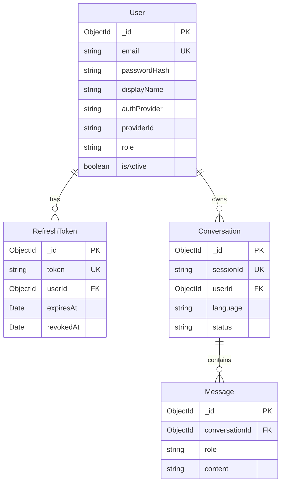

# Data Model: Auth Module + MongoDB Persistence

**Feature**: 001-nestjs-backend-foundation (bổ sung auth module)
**Date**: 2026-06-04

---

## Entity: User

Tài khoản người dùng (seller). Hỗ trợ đăng ký bằng email/password hoặc OAuth (Google).

| Field | Type | Constraints | Description |
|---|---|---|---|
| `_id` | ObjectId | PK, auto | MongoDB primary key |
| `email` | string | unique, required, lowercase, trim | Email đăng nhập / liên kết OAuth |
| `passwordHash` | string | optional | bcrypt hash; null nếu OAuth-only user |
| `displayName` | string | optional | Tên hiển thị |
| `avatar` | string | optional | URL ảnh đại diện (từ OAuth hoặc upload) |
| `authProvider` | enum | required, default `'local'` | `'local'` \| `'google'` — provider đăng ký chính |
| `providerId` | string | optional, sparse unique | ID từ OAuth provider (googleId); null nếu local |
| `role` | enum | required, default `'user'` | `'user'` \| `'admin'` — phân quyền cơ bản |
| `isActive` | boolean | required, default `true` | Cho phép disable tài khoản |
| `lastLoginAt` | Date | optional | Thời điểm login gần nhất |
| `createdAt` | Date | auto (timestamps) | Thời điểm tạo |
| `updatedAt` | Date | auto (timestamps) | Thời điểm cập nhật |

**Indexes**:
- `email`: unique
- `{ authProvider, providerId }`: unique sparse (cho OAuth lookup)

**Validation rules**:
- Email phải hợp lệ (regex hoặc class-validator `@IsEmail`)
- Password (khi local): tối thiểu 8 ký tự, ít nhất 1 chữ hoa + 1 số
- `authProvider` + `providerId` phải đi cùng (nếu provider ≠ local thì providerId required)

**State transitions**:
- `isActive: true → false`: Admin disable → user không thể login
- `authProvider: local`: Có thể link thêm OAuth provider sau (chưa triển khai ở phase này)

---

## Entity: RefreshToken

Token làm mới JWT access token. Lưu MongoDB để hỗ trợ revocation.

| Field | Type | Constraints | Description |
|---|---|---|---|
| `_id` | ObjectId | PK, auto | MongoDB primary key |
| `token` | string | unique, required, indexed | UUID v4 — giá trị refresh token |
| `userId` | ObjectId | required, ref → User | Chủ sở hữu token |
| `expiresAt` | Date | required | Thời điểm hết hạn (7 ngày) |
| `revokedAt` | Date | optional | Nếu có → token đã bị revoke |
| `userAgent` | string | optional | User-Agent lúc tạo token (audit) |
| `ipAddress` | string | optional | IP lúc tạo token (audit) |
| `createdAt` | Date | auto (timestamps) | Thời điểm tạo |

**Indexes**:
- `token`: unique
- `userId`: regular (lookup all tokens of user)
- `expiresAt`: TTL index (MongoDB auto-delete expired documents)

**Validation rules**:
- `expiresAt` phải > now lúc tạo
- Mỗi user tối đa 5 active refresh tokens (FIFO xóa cũ nhất)

---

## Entity: Conversation (MongoDB — durable persistence)

Lưu trữ dài hạn conversation history gắn với user. Bổ sung cho Redis session (ngắn hạn).

| Field | Type | Constraints | Description |
|---|---|---|---|
| `_id` | ObjectId | PK, auto | MongoDB primary key |
| `sessionId` | string | required, unique, indexed | UUID session — mapping với Redis session |
| `userId` | ObjectId | required, ref → User, indexed | Chủ phiên hội thoại |
| `language` | enum | optional | `'vi'` \| `'en'` |
| `title` | string | optional | Tự động tạo từ message đầu tiên hoặc user đặt |
| `status` | enum | required, default `'active'` | `'active'` \| `'archived'` |
| `createdAt` | Date | auto (timestamps) | Thời điểm tạo |
| `updatedAt` | Date | auto (timestamps) | Cập nhật khi có turn mới |

**Indexes**:
- `sessionId`: unique
- `userId`: regular (list conversations of user)
- `{ userId, updatedAt }`: compound descending (recent conversations first)

---

## Entity: Message (MongoDB — durable persistence)

Lượt hội thoại lưu dài hạn, embed trong hoặc ref từ Conversation.

| Field | Type | Constraints | Description |
|---|---|---|---|
| `_id` | ObjectId | PK, auto | MongoDB primary key |
| `conversationId` | ObjectId | required, ref → Conversation, indexed | Phiên chứa message |
| `role` | enum | required | `'user'` \| `'assistant'` |
| `content` | string | required | Nội dung message |
| `createdAt` | Date | auto (timestamps) | Thời điểm gửi |

**Indexes**:
- `conversationId`: regular (load messages of conversation)
- `{ conversationId, createdAt }`: compound ascending (chronological order)

---

## Relationships

---

## Redis ↔ MongoDB Sync Strategy

| Store | Data | TTL | Purpose |
|---|---|---|---|
| **Redis** | Session metadata + recent turns | 1h (configurable) | Real-time agent context, fast read |
| **MongoDB** | User, Conversation, Message, RefreshToken | Permanent (hoặc TTL index) | Durable storage, history, auth |

**Sync flow**:
1. Khi tạo conversation → ghi cả Redis (session) + MongoDB (Conversation doc).
2. Khi append turn → ghi Redis (real-time) + MongoDB (Message doc) đồng thời.
3. Khi Redis session expire → MongoDB Conversation vẫn truy vấn được (history).
4. Khi user load conversation history → đọc từ MongoDB (bypass Redis TTL).
